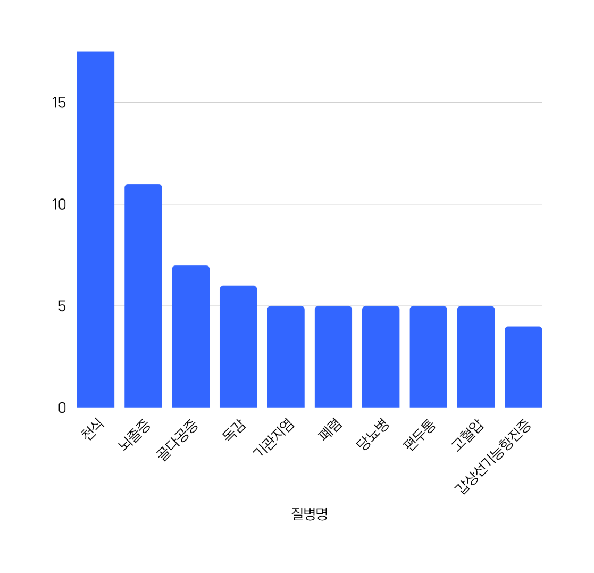

# wh06-2nd-medimenti 

# 🩺MediMento(메디멘토)

<div style="text-align: center;">
  <figure style="display: inline-block; margin: 0;">
    
    <figcaption style="font-size: 14px; color: gray; margin-top: 5px;">
      MediMento(메디멘토) logo
    </figcaption>
  </figure>
</div>


<br><br>

# 1. 프로젝트 정의

#### 프로젝트 주제
- 증상 기반 질병 예측 및 일반 의약품 추천 시스템

#### 문제 정의
- 진료 대기 시간 증가에 따른 사용자 불만족 증가
- 사용자는 증상을 느껴도 어떤 병인지, 어떤 약을 복용해야할지 알기 어려움, 처방전 없이 구입 가능한 약 정보 접근도 제한적
- 비대면 진료 시장의 전망 유망

#### 서비스 목표
  - 사용자가 증상을 입력하면 질병을 예측하고, 약 추천까지 한 번에 제공하는 서비스 구현
  - 서비스 플로우 : 
      - 사용자가 자신의 증상을 입력(선택)
      - 입력 받은 내용을 바탕으로 어떤 병인지 예측
      - 병명, 증상에 따른 약 추천
      - 서비스 사용자의 전체 데이터를 시각화

- 기획 의도 및 기대 효과 
    1. 질병 초기 대응
    2. 유행 질병 파악
    - 사용자의 증상을 분석해 해당 증상을 완화해 줄 수 있는 약을 쉽고 빠르게 추천 가능 -> 처방 없이 구매 가능한 약 구매시 유용
    - 사용자가 입력한 데이터를 집계, 시각화하여 현재 어떤 증상이 많고 어떤 질병이 유행하는지 인사이트 제공
    - 환자의 증상, 유행병 관련 정보를 수집할 수 있어 의료계에서 빠르게 대처 방안 구상 가능

<br><br>


# 2. 주요 내용
#### 프로젝트 기간
- 2025-06-26 ~ 2025-07-02 (총 5일)
#### 팀명
- MediMenti(메디멘티)
#### 참여 인원


<table>
  <tr>
    <th>이름</th>
    <th>사진</th>
    <th>역할</th>
  </tr>
  <tr>
    <td>이민진</td>
    <td></td>
    <td>팀장</td>
  </tr>
  <tr>
    <td>서세빈</td>
    <td></td>
    <td>팀원</td>
  </tr>
  <tr>
    <td>유지선</td>
    <td></td>
    <td>팀원</td>
  </tr>
  <tr>
    <td>오요셉</td>
    <td></td>
    <td>팀원</td>
  </tr>
  <tr>
    <td>주수진</td>
    <td></td>
    <td>팀원</td>
  </tr>
</table>

#### 데이터 출처
  - [Disease Symptoms and Patient Profile Dataset](https://www.kaggle.com/datasets/uom190346a/disease-symptoms-and-patient-profile-dataset)
  - [Disease Symptom Prediction](https://www.kaggle.com/datasets/itachi9604/disease-symptom-description-dataset)
  - [식품의약품안전처_의약품개요정보(e약은요)](https://www.data.go.kr/data/15075057/openapi.do)

<br><br>

# 3. 프로젝트 일정


| 단계                    | 일수 | 작업 내용                                                                 |
|-------------------------|------|---------------------------------------------------------------------------|
| 기획 및 요구사항 정의   | 1일차  | 서비스 목표 설정, 핵심 기능 정의, 사용자 흐름 및 UX 설계                |
| 데이터 수집 및 전처리   | 2일차  | 데이터 필드 정의, 데이터 수집, 데이터 정제 및 통합                      |
| 예측 모델 개발         | 3일차  | 질병 예측 모델 개발, 학습 및 검증, Streamlit 연동 테스트                |
| 시스템 구현             | 4일차  | 프론트엔드 및 백엔드 개발, 머신러닝 모델 API 연동, 대시보드 개발        |
| 테스트 및 배포         | 5일차  | 단위 테스트 및 전체 테스트, 버그 수정, 최종 배포                        |

<br><br>


# 4. 작업 분할 구조 (WBS)

| 분류                   | 단계 | 작업 내용                                               |
|------------------------|------|----------------------------------------------------------|
| 기획 및 요구사항 정의 | 1-1  | 기획 서비스 및 목표 설정                                 |
|                        | 1-2  | 핵심 기능 정의 (예: 증상 입력, 예측, 약 추천)            |
|                        | 1-3  | 사용자 흐름 및 UX 시나리오 작성                         |
|                        | 1-4  | 기술 스택 및 아키텍처 개요 설계                         |
| 데이터 정의 및 수집   | 2-1  | 주요 데이터 필드 정의 (증상, 질병, 약)                  |
|                        | 2-2  | Kaggle / 공공데이터 수집 및 정제                        |
|                        | 2-3  | 공공 API 검토 및 응답 분석                              |
|                        | 2-4  | 수집된 데이터 전처리 및 통합                            |
| 예측 모델 개발        | 3-1  | 증상 기반 질병 예측 모델 개발                          |
|                        | 3-2  | 모델 학습 및 성능 검증                                 |
|                        | 3-3  | Streamlit에서 모델 튜닝 및 테스트                      |
| 시스템 구현           | 4-1  | 프론트엔드 UI/UX 설계 및 개발 (Figma + Streamlit)      |
|                        | 4-2  | 백엔드 API 및 DB 구축                                   |
|                        | 4-3  | 머신러닝 모델 연동 및 API 연결                          |
|                        | 4-4  | 대시보드 및 통계 시각화 개발                           |
| 테스트 및 배포        | 5-1  | 기능별 단위 테스트                                     |
|                        | 5-2  | 전체 사용자 흐름 테스트                                |
|                        | 5-3  | 버그 수정 및 UX 개선                                   |
|                        | 5-4  | 배포 환경 구성 및 최종 배포                            |

<br><br>

# WBS 세부 내용

## 1. 데이터 정의 
#### Kaggle : 질병-환자 정보 Dataset
- 수집처 
  - [Disease Symptoms and Patient Profile Dataset](https://www.kaggle.com/datasets/uom190346a/disease-symptoms-and-patient-profile-dataset)
- 수집 방식 : CSV 파일


### 공공데이터 : 의약품 정보 Dataset
- 수집처
  - [식품의약품안전처_의약품개요정보(e약은요)](https://www.data.go.kr/data/15075057/openapi.do)
- 수집 방식 : API, json


<br>

## 2. 데이터 수집 및 설계
### 데이터 수집 및 전처리
#### Kaggle : 질병-환자 정보 Dataset
- 환자의 `Disease Symptoms and Patient Profile Dataset` 데이터셋에서 증상 발현이 Positive인 칼럼 추출
- 특정 질병의 등장횟수가 2회 이하인 칼럼 제거 (모델링 학습)
- columns
    - Disease
    - Fever
    - Cough
    - Fatigue
    - Difficulty Breathing
    - Age
    - Gender
    - Blood Pressure
    - Cholesterol Level

### 공공데이터 : 의약품 정보 Dataset
- `식품의약품안전처_의약품개요정보(e약은요)` 데이터셋의 **효능** 칼럼에서 `Disease Symptoms and Patient Profile Dataset`의 증상(열, 기침, 피로, 호흡 곤란)과 특이사항(혈압, 콜레스테롤) 키워드를 포함하고 있는 데이터 추출
- 가장 빈도가 높은 질병 Top 10의 질병명 한글화
  - 천식, 뇌졸중, 골다공증, 독감, 기관지염, 폐렴, 당뇨병, 편두통, 고혈압, 갑상선기능항진증
- columns
    - Enterprise Name
    - Item Name
    - Efficacy (효능)
    - Use Method (사용법 - 복용법)
    - Side Effect (부작용)


<br>

## 3. 분석 및 모델링

### 3.1 EDA
<div>
  <figure style="display: inline-block; margin: 0;">
  
    <figcaption style="font-size: 14px; color: gray; margin-top: px;">환자 수가 가장 많은 Top 10 질병의 발병 빈도수</figcaption>
  
    <figcaption style="font-size: 14px; color: gray; margin-top: px;">환자 수가 가장 많은 Top 10 질병의 성별 분포</figcaption>
  
    <figcaption style="font-size: 14px; color: gray; margin-top: px;">환자 수가 가장 많은 Top 10 질병의 환자 나이 분포</figcaption>
</div>


### 3.2 모델링

- 컬럼 encoding
    - 수치형 변수 (나이) : `sklearn.preprocessing의 StandardScaler` (평균 0, 표준편차 1)
    - 범주형 변수 (증상여부, 성별, 혈압/콜레스테롤 수치) : `sklearn.preprocessing`의 `OneHotEncoder`
    - 범주형 변수 (질병명) : `sklearn.preprocessing`의 `LabelEncoder` (컬럼이 다양해서 원-핫 인코더 사용 불가능)

- 최종 사용한 분류 모델 : `Gradient Boosting Classifier`
    - 사용한 모델들
        - **Decision Tree Classifier** : 데이터를 분석하여 규칙 기반의 트리 구조를 만들고, 이를 통해 데이터를 분류하거나 예측하는 지도 학습 알고리즘
        - **Random Forest Classifier** : 여러 개의 약한 학습기(의사 결정 트리)를 순차적으로 연결하여 예측 성능 높이는 앙상블 학습 방법 (Bagging 방식 - 복원추출)
        - **SVM** : N차원 공간에서 각 클래스 간의 거리를 최대화하는 최적의 선 또는 초평면을 찾아 데이터를 분류하는 지도형 머신 러닝 알고리즘
        - **Gradient Boosting Classifier** : 여러 개의 약한 학습기(의사 결정 트리)를 순차적으로 연결하여 예측 성능 높이는 앙상블 학습 방법 (Boosting 방식 - 복원추출 + 가중치) 


```python
# 분류 모델 파이프라인 구성요소

numeric_transformer = Pipeline(steps=[
    ('impute', SimpleImputer(strategy='median')),
    ('scaler', StandardScaler())
])

categorical_transformer = Pipeline(steps=[
    ('impute', SimpleImputer(strategy='constant', fill_value='missing')),
    ('onehot', OneHotEncoder(handle_unknown='ignore', sparse_output=False))
])

preprocessor = ColumnTransformer(
    transformers = [
        ('num', numeric_transformer, numeric_features),
        ('cat', categorical_transformer, categorical_features)
    ]
)

models = {
    'Random Forest Classifier' : RandomForestClassifier(n_estimators=100, random_state=42),
    'Gradient Boosting Classifier' : GradientBoostingClassifier(n_estimators=100, random_state=42),
    'SVM' : SVC(kernel='rbf', probability=True, random_state=42)
}

```
- 평가지표 : 정확도 (accuracy)
    - 전체 데이터 중에서 모델이 올바르게 예측한 데이터의 비율을 의미
    - 예측 결과가 실제 결과와 얼마나 일치하는지를 나타내는 지표
    - 전체 모델 중 정확도가 가장 높았던 - **Gradient Boosting Classifier 모델 최종 선택**

<br>

## 4. 배포
- Streamlit 대시보드로 배포
- 회원가입/로그인 화면 구현 => 사용자 정보 저장
- 메인 화면 구현
  - 증상입력, 해당사항 선택
  - 질병 예측 후 추천 약 정보(최대 3개)
  - 사용자 누적 통계

<br><br>

# 5. 요구사항 정의서


| **대분류** | **소분류**  | **요구사항 ID** | **요구사항명**      | **요구사항 내용**                             |
| ------- | -------- | ----------- | -------------- | --------------------------------------- |
| 회원 기능   | 회원가입     | MM-001      | 사용자 정보 입력      | 사용자 ID, 비밀번호, 성별, 나이를 입력받아 회원가입 처리      |
|         | 로그인      | MM-002      | 로그인 기능         | ID와 비밀번호를 입력받아 인증 후 로그인 처리              |
|         | 로그아웃     | MM-003      | 로그아웃 기능        | 로그인된 세션을 종료하고 로그아웃                      |
|         | 마이페이지    | MM-004      | 마이페이지 조회       | 사용자는 본인의 증상 입력 이력, 예측 결과, 약 추천 기록을 확인   |
| 증상 입력   | 체크리스트    | MM-005      | 증상 체크리스트 입력    | 사용자가 제공된 증상 목록 중 해당하는 항목을 선택하여 입력 가능    |
| 질병 예측   | 예측 모델    | MM-006      | AI 질병 예측       | 사용자의 증상을 기반으로 머신러닝 모델을 통해 가능성 높은 질병을 예측 |
| 약 정보 추천 | 질병별 약 추천 | MM-007      | 약 정보 추천        | 예측된 질병에 따라 관련 일반의약품 정보를 추천              |
| 시각화     | 사용자 데이터  | MM-008      | 개인 시각화 대시보드    | 사용자의 증상, 예측 질병, 약 추천 결과를 그래프나 차트로 시각화   |
|         | 전체 통계    | MM-009      | 전체 사용자 데이터 시각화 | 전체 사용자 데이터를 기반으로 증상, 질병, 약에 대한 통계를 시각화  |

<br><br>

# 6. 프로젝트 설계서

## 워크 프로세스 설계 및 아키텍처
<div style="text-align: center;">
  
</div>
<br>

## 설계 개요

| 단계명         | 설명                                                                 |
|----------------|----------------------------------------------------------------------|
| 데이터 수집     | `Requests` 라이브러리를 활용해 웹에서 데이터 파일 다운로드             |
| 데이터 처리     | `Python pandas`로 전처리 수행                                        |
| 데이터 저장     | `Pandas DataFrame` 형태로 데이터 관리                                 |
|                 | 필요에 따라 CSV 파일로 저장 가능                                      |
|                 | `Pandas`를 이용해 데이터 전처리 및 분석 수행                          |
|                 | `SQLite`에 데이터 적재
| 분석 및 시각화  | `Matplotlib`, `Seaborn`을 활용해 시각화                                |
|                 | `Streamlit`으로 대시보드 제작                                          |


<br>

## 기술 스택

| 분류         | 설명                                                                 |
|--------------|----------------------------------------------------------------------|
| 데이터 수집  | `Python requests` (웹 데이터(API) 파일 다운로드)                     |
|              | `Python pandas` (파싱 클리닝 및 데이터 조회)                         |
| 데이터 처리  | `Pandas`: 데이터 전처리 및 분석                                      |
|              | `Numpy`: 수치 연산 및 배열 처리                                      |
|              | `sklearn.preprocessing StandardScaler`,`sklearn.preprocessing OneHotEncoder`, `sklearn.preprocessing LabelEncoder` : 컬럼 encoding                                           |
| 모델링       | `Decision Tree Classifier`, `Random Forest Classifier`, `SVM`, `Gradient Boosting Classifier` |
| 분석 및 시각화 | `Matplotlib`, `Seaborn`: 데이터 시각화                                |
|                | `figma` : 앱 화면 구현                                                |
|               | `Streamlit`: 대시보드 및 웹 애플리케이션 개발                          |

<br>

## 데이터 설계
### ERD
<div style="text-align: center;">
  
</div>


### DB 저장
<div style='text-align: center;'>

</div>

<br><br>

## 프로토타입
#### 로그인/ 회원가입
<div style='text-align: center;'>


</div>


#### 증상 입력 및 질병 예측
<div style="display: flex; justify-content: center; gap: 10px;">
  
  
</div>


#### 사용자 분석

<div style="display: flex; justify-content: center; gap: 10px;">


</div>
<br>
<div style="display: flex; justify-content: center; gap: 10px;">


</div>

#### 마이페이지/회원정보 수정
<div style="display: flex; justify-content: center; gap: 10px;">


</div>


<br><br>

## 향후 개선점 : APP
<div style='text-align: center;'>


</div>


